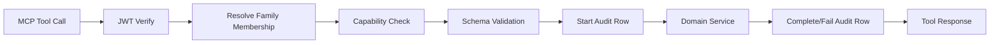

# Architecture

## Layers

1. MCP Transport
- `src/server/index.ts` registers tools and exposes stdio transport.

2. Auth and Context
- `src/auth/jwt.ts` validates Supabase JWT.
- `src/auth/session.ts` resolves `AuthContext` (`userId`, `familyId`, role, token, optional Google token metadata).

3. Authorization
- `src/tools/capabilities.ts` maps tool -> required capability.
- `src/tools/authorization.ts` derives grants from the verified family role and intersects the client-requested scope.

4. Domain Services
- `src/services/*` perform family-scoped data access via Supabase with user JWT.

5. Providers
- `src/providers/*` wrap external providers and AI/OCR abstractions.

6. Auditing
- `src/middleware/audit.ts` keeps structured logs.
- `src/services/audit-service.ts` persists `started`, `success`, `denied`, and `failed` rows in Supabase.

## Request Flow

## Documents

The MCP document flow mirrors the Web app tables: `documents`, `document_versions`, `document_ocr_jobs`, `document_metadata`, `alerts`, and `events`. Files are uploaded to the private `family-documents` bucket. OCR uses Google Vision for images when `GOOGLE_VISION_API_KEY` is configured; PDFs are accepted and stored, but require an external worker/text extraction dependency for real OCR.

## Calendar

The Web app currently obtains Google `provider_token` from the active Supabase session. The MCP server has no secure refresh-token store, so Calendar tools use a token supplied by the MCP client for the current call. Write operations require `https://www.googleapis.com/auth/calendar.events`.

## Deployment

- Runtime: Node 20+
- Transport: stdio
- Database: Supabase Postgres with RLS
- Logs: JSON via pino
